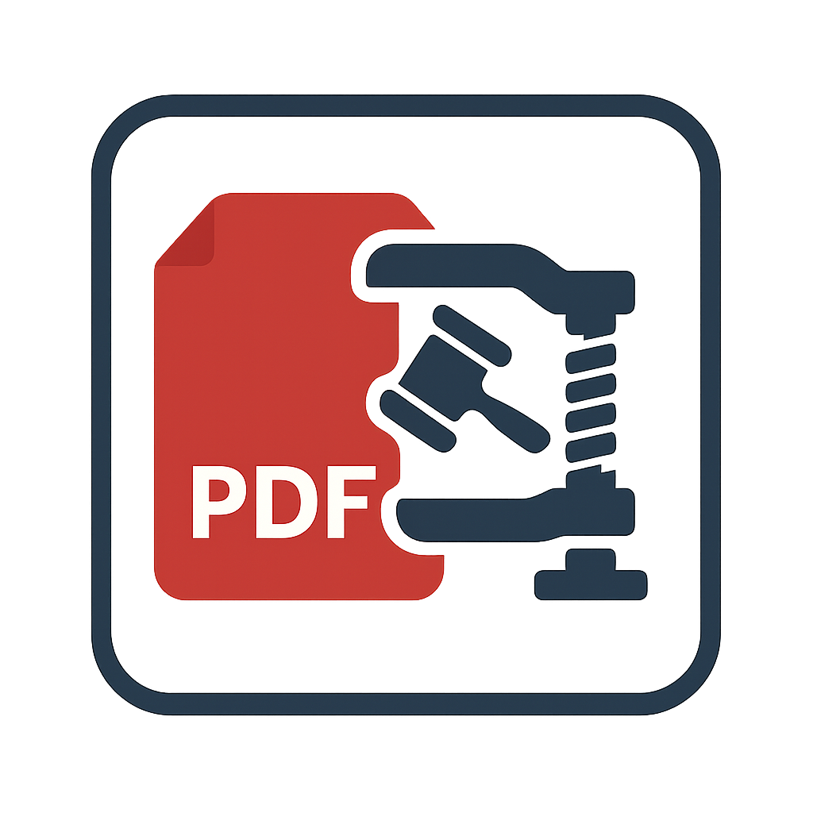

# ⚖️ LegalDocs – Herramienta de Escritorio para la Gestión Segura de Archivos PDF




## 🧾 ¿Qué es LegalDocs?
LegalDocs surge como una herramienta pensada para quienes trabajamos con documentación sensible y extensa, especialmente en el ámbito judicial. Al escanear expedientes, legajos o informes de muchas fojas, es habitual obtener archivos PDF con un peso elevado que dificulta su envío.

Plataformas de correo electrónico —incluidos los correos oficiales del Poder Judicial— imponen límites de tamaño (como el tope de 25 MB), lo que representa un obstáculo frecuente para el intercambio eficiente de información.

Ante esta dificultad, muchos usuarios, por desconocimiento o urgencia, recurren a servicios web gratuitos para comprimir archivos PDF sin tener certeza de dónde terminan alojados esos documentos ni qué uso puede dárseles. Esto representa un riesgo grave cuando se trata de material confidencial o sensible.

LegalDocs ofrece una solución simple, local y segura para comprimir, visualizar y gestionar estos documentos sin depender de servicios web de terceros, preservando así la confidencialidad del material.

## 🛠️ Funcionalidades principales
Esta herramienta de escritorio te permite realizar tres tareas clave, de manera ágil y sin comprometer la privacidad:

## 📄 Convertir Word a PDF
Convierte fácilmente archivos .docx (Microsoft Word) a PDF, asegurando la compatibilidad y el formato profesional del documento final.

## ✂️ Eliminar páginas de un PDF
Visualizá las páginas de un archivo PDF y seleccioná aquellas que deseás eliminar. Luego, generá una nueva versión del documento sin las páginas indeseadas.

## 📉 Comprimir archivos PDF
Reducí significativamente el tamaño de tus documentos sin perder calidad. Ideal para envíos por email o carga en plataformas con límite de peso. Se incluyen distintos niveles de compresión para ajustarse a tus necesidades.


# 🛡️ ¿Por qué elegir LegalDocs en lugar de herramientas online?
Al ser una aplicación de escritorio, LegalDocs ofrece ventajas notables frente a las soluciones web:

## 🔒 Seguridad y privacidad
Tus archivos nunca se suben a servidores externos. Todo el procesamiento se realiza localmente, garantizando la confidencialidad de la información.

## ⚡ Velocidad y rendimiento
Aprovecha los recursos de tu propio equipo para lograr un procesamiento rápido, incluso con documentos extensos.

## 📶 Autonomía sin internet
Funciona completamente offline. Ideal para entornos de trabajo con conexión limitada o sin acceso a internet.

## 🧭 Control total del proceso
Elegí cómo, cuándo y dónde guardar tus archivos. Sin anuncios, sin esperas, sin riesgos.


# 💻 Requisitos 

Sistema operativo: Windows 10/11 (Indispensable)

Python 3.10 o superior - (Solo instalacion Avanzada)

Ghostscript instalado y agregado al PATH (para compresión PDF) - (Solo instalacion Avanzada)


## 📦 Instalación

### 🔹 Opción recomendada (sin necesidad de instalar nada)

Podés descargar directamente el archivo ejecutable `.exe` para **Windows**, listo para usar:

> 👉 **[Descargar LegalDocs.exe](https://github.com/Gh3rmy/LegalDocsPDF/releases/download/v1.0.0/LegalDocsPDF.exe)**  
>
Hash256: 4bc3ccc0d83e638224cca4322ff3d364fb6a268ea5f9c10ada1a87b70f16558e

- ✅ No requiere conocimientos técnicos ni instalación de Python.
- ✅ Basta con descomprimir el `.zip` y ejecutar el archivo `LegalDocs.exe`.
- ✅ Ideal para colegas del ámbito judicial que solo necesitan una solución rápida y segura.

---

### 🔸 Opción para desarrolladores o usuarios avanzados

Si preferís ejecutar el proyecto desde el código fuente, seguí estos pasos:

Asegurate de tener Ghostscript instalado y agregado al PATH (es necesario para la compresión de PDF).

Ejecutá la aplicación:

1. Cloná o descargá este repositorio.
2. Instalá las dependencias:
   ```bash
   pip install -r requirements.txt
    ```
    ```bash
   python main.py
    ```

    *Toda contribucion es bienvenida*

## 👤 Autor

**German Rojas**  
Desarrollado pensando en profesionales del ámbito judicial que necesitan herramientas locales, seguras y eficientes para trabajar con documentos PDF.  
📧 Contacto: *germanigrojas@gmail.com*

## 📝 Licencia

Este proyecto está bajo la licencia [MIT](https://choosealicense.com/licenses/mit/).


